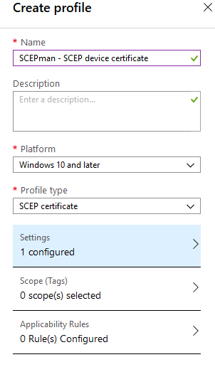

# Windows 10

The following article describes how to deploy a device certificate or a user certificate for Windows 10.

## Deploying Device Certificates

The following section will show you how you can deploy device certificates via Intune Certificate profile on Windows 10 \(or later\) devices.

First, we need to trust the public root certificate from SCEPman. Therefore, you have to download the CA certificate \(from SCEPman\) and deploy it via a trusted certificate profile in Microsoft Intune:

Download the CA certificate:

Then, create a profile in Microsoft Intune:

1. Enter a **Name**
2. As **Platform** select **Windows 10 or later**
3. As **Profile type** select **Trusted certificate**
4. Click **Settings**, select **A valid .cer file**
5. As **Destination store** select **Computer certificate store - Root**
6. Then, click **OK**
7. Finally, click **Create**

When you are finsihed with it, you can deploy this profile to your devices.

Now, you have to create a SCEP certificate profile to deploy the device certificates. Important for this step is the SCEP Server URL. This URL can be found in the **Overview** submenu of the app service of SCEPman:

Append the following to your URL: **/certsrv/mscep/mscep.dll**. Note this URL: [https://scepman-xxx.azurewebsites.net/certsrv/mscep/mscep.dll](https://scepman-xxx.azurewebsites.net/certsrv/mscep/mscep.dll)  
\('xxx' is a placeholder\)

Next, to finally deploy the device certificates, you have to create a SCEP certificate profile in Intune:

1. Navigate to **Microsoft Intune**
2. Click **Device Configuration**
3. Choose **Profiles** and click **Create profile**
4. Then, enter a **Name**
5. Select **Windows 10 and later** as **Platform**
6. Select **SCEP certificate** as **Profile type**
7. Click **Settings**

1. Configure the **SCEP Certificate**


You can not configure all **SCEP Certificate** settings. This is because some settings are mandatory to set by SCEPman, the yellow rectangle is automatically set by SCEPman \(for better visibility we recommend to set the settings in the yellow rectangle to the SCEPman mandatory settings like shown below\). Hereby is the Key usage set to **Digital signature** and **Key encipherment**. The validity period is set to fixed 6 months currently. The red rectangle is a setting that is free to modify. Long term all settings will be supported for configuration. **There is a dependency on the {{AAD\_Device\_ID} in the subject name, which is used as a seed for the certificate serial number generation. Therefore the subject name must include**.


1. Scroll down and enter the URL you have noted
2. Then, click **Add**
3. Next, click **OK** and finally click **Create**

When all is finished, you have the following two certificate configurations:

* SCEPman - SCEP device certificate
* SCEPman - Trusted root certificate

## Deploying User Certificates

The following section will show you how you can deploy user certificates via Intune Certificate profile on Windows 10 \(or later\) devices.

First, we need to trust the public root certificate from SCEPman. Therefore, you have to download the CA certificate \(from SCEPman\) and deploy it via a trusted certificate profile in Microsoft Intune:

Download the CA certificate:

Then, create a profile in Microsoft Intune:

1. Enter a **Name**
2. As **Platform** select **Windows 10 or later**
3. As **Profile type** select **Trusted certificate**
4. Click **Settings**, select **A valid .cer file**
5. As **Destination store** select **Computer certificate store - Root**
6. Then, click **OK**
7. Finally, click **Create**

When you are done with it you can deploy this profile to your devices.

Now, you have to create a SCEP certificate profile to deploy the device certificates. Important for this step is the SCEP Server URL. This URL can be found in the **Overview** submenu of the app service of SCEPman:

Append the following to your URL: **/certsrv/mscep/mscep.dll**. Note this URL: [https://scepman-xxx.azurewebsites.net/certsrv/mscep/mscep.dll](https://scepman-xxx.azurewebsites.net/certsrv/mscep/mscep.dll)  
\('xxx' is a placeholder\)

Next, to finally deploy the device certificates you have to create a SCEP certificate profile in Intune:

1. Navigate to **Microsoft Intune**
2. Click **Device Configuration**
3. Choose **Profile** and click **Create profile**
4. Then, enter a **Name**
5. Select **Windows 10 and later** as **Platform**
6. Select **SCEP certificate** as **Profile type**
7. Click **Settings**

1. Configure the **SCEP Certificate**


You can not configure all **SCEP Certificate** settings. This is because some settings are mandatory set by SCEPman, the yellow rectangle is automatically set by SCEPman \(for better visibility we recommend to set the settings in the yellow rectangle to the SCEPman mandatory settings like shown below\). Hereby is the Key usage set to **Digital signature** and **Key encipherment**. For SCEPman version before 1.5, the validity period is set to a fixed 6 month. For SCEPman 1.5 and above, SCEPman caps the certificate validity if it is above the configured maximum, but otherwise uses the validity configured in the request. The red rectangle is a setting that is free to modify. Long term all settings will be supported for configuration. **The setting for 'Subject name format' is freely selectable. For the Subject alternative name we recommend to set 'User principal name \(UPN\)'.**


1. Scroll down and enter the URL you have noted
2. Then, click **Add**
3. Next click **OK** and finally click **Create**

When all its done, you have the following two certificate configurations:

* SCEPman - SCEP user certificate
* SCEPman - Trusted root certificate

