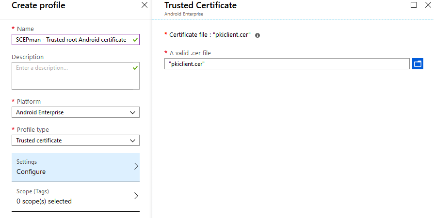
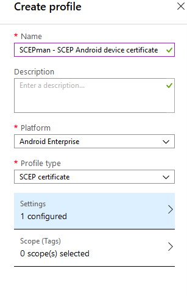
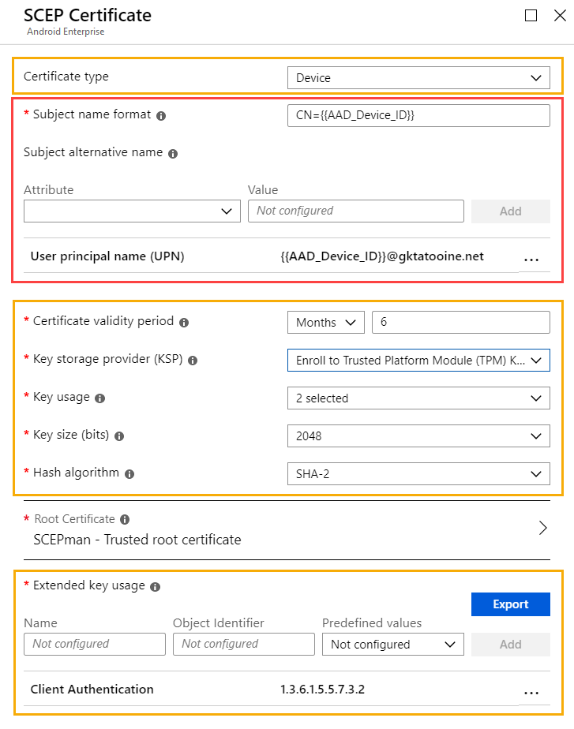

# Android

## Deploying Device Certificates - Android Enterprise

It is not only possible to deploy certificates on [Windows 10 devices](05_certificate_deployment_win10.md) or [macOS devices](https://github.com/glueckkanja/gk-scepman-docs/tree/8dd5e83c3dd91576810d6a7f58bb173cb6cc9536/docs/06_certificate_deployment_macOS.md), of course you can create [Android](https://github.com/glueckkanja/gk-scepman-docs/tree/8dd5e83c3dd91576810d6a7f58bb173cb6cc9536/docs/07_cert_mobile_client.md#android-enterprise-certificate-deployment) and [iOS](https://github.com/glueckkanja/gk-scepman-docs/tree/8dd5e83c3dd91576810d6a7f58bb173cb6cc9536/docs/07_cert_mobile_client.md#ios-enterprise-certificate-deployment) profiles as well. All platforms are supported by SCEPman.

Android offers two different solution sets for using a Android device. A [work profile](https://developers.google.com/android/work/requirements/work-profile) solution set and a [fully managed device](https://developers.google.com/android/work/requirements/fully-managed-device) solution set.

## Certificate Deployment for Android Work Profiles

First, we need to trust the public root certificate from SCEPman. Therefore, you have to download the CA certificate \(from SCEPman\) and deploy it via a trusted certificate profile in Microsoft Intune:

Download the CA certificate:

Then, create a profile in Microsoft Intune:

1. Download the CA Certificate
2. Then, create a profile in Microsoft Intune
3. Select **Android Enterprise** as **Platform**
4. Select **Trusted Certificate** as **Profile type**
5. Click **Settings**, select **A valid .cer file**
6. Then, click **OK**
7. Finally, click **Create**

When you are done with it you can deploy this profile to your devices.

Now, you have to create a SCEP certificate profile to deploy the device certificates. Important for this step is the SCEP Server URL. This URL can be found in the **Overview** submenu of the app service of SCEPman:

Append the following to your URL: **/certsrv/mscep/mscep.dll**. Note this URL: [https://scepman-xxx.azurewebsites.net/certsrv/mscep/mscep.dll](https://scepman-xxx.azurewebsites.net/certsrv/mscep/mscep.dll)

Next, to finally deploy the device certificates you have to create a SCEP certificate profile in Intune:

1. Navigate to **Microsoft Intune**
2. Click **Device Configuration**
3. Choose **Profile** and click **Create profile**
4. Then, enter a **Name**
5. Select **Android Enterprise** as **Platform**
6. Select **SCEP Certificate** as **Profile type**
7. Click **Settings**

8. Configure the **SCEP Certificate**


You can not configure all **SCEP Certificate** settings. This is because some settings are mandatory set by SCEPman, the yellow rectangle is automatically set by SCEPman \(for better visibility I recommend to set the settings in the yellow rectangle to the SCEPman mandatory settings like shown below\). Hereby is the Key usage set to **Digital signature** and **Key encipherment**. The validity period is set to fixed 6 month currently. The red rectangle are settings which are free to modify. Long term all settings will be supported for configuration. **There is a dependency on the  in the subject name, which is used as a seed for the certificate serial number generation. Therefore the subject name must include**.


1. Scroll down and enter the URL you have noted
2. Then, click **Add**
3. Next click **OK** and finally click **Create**

When all its done, you have the following two certificate configurations:

* SCEPman - SCEP Android device certificate
* SCEPman - Trusted root Android certificate

### Subject Alternative Name

A [Subject alternative name](https://tools.ietf.org/html/rfc5280#section-4.2.1.6) \(SAN\) is important for the whole android device login process into a Wi-Fi profile. It can be divided into three phases:

1. During the enrollment phase you have to login to your company portal with a company domain \(like john.doe@companyname.com\)
2. When the synchronization starts the device gets a certificate and a Wi-Fi.
3. The Wi-Fi profile will be deployed. In detail, the following steps working in background:
   * SAN verification \([RFC 2818](https://tools.ietf.org/html/rfc2818)\)
   * Search for certifications and profiles, based on your company domain
   * Deploy Wi-Fi profile on your device

It is much important to enter a **Subject alternative name** into the **SCEP Certificate**. Without a SAN you have no access to your company WLAN.

### My Certificates

To check if your certificate runs well on your Android device you can use [My Certificates](https://play.google.com/store/apps/details?id=com.wesbunton.projects.mycertificates&hl=en) from Google Play.

## Certificate Deployment for Fully Managed Devices


**Coming soon!**


Microsoft is working on the support for SCEP and fully managed devices.

The use of fully managed devices is most likely the same as work profile but certificates can be natively viewed.

## Next Step

* [Troubleshooting](https://github.com/glueckkanja/gk-scepman-docs/tree/8dd5e83c3dd91576810d6a7f58bb173cb6cc9536/docs/11_troubleshooting.md)

