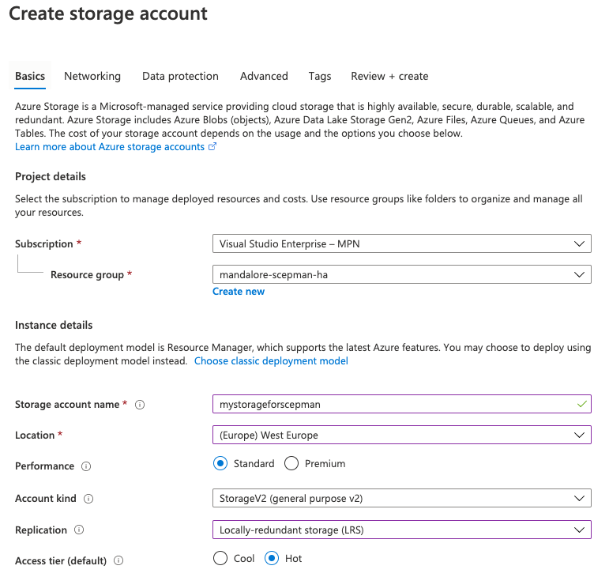
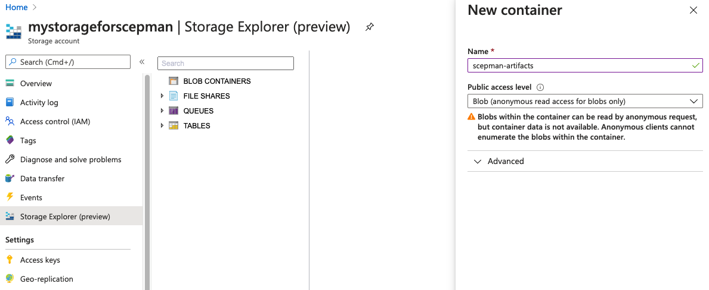

# Application Artifacts

## Available Channels

We offer three channels for our SCEPman application. 

Production  
- full released version  
- function and load-tested  
- bugs not expected  
  
Beta  
- next production release  
- function tested, but no load-test  
- bugs possible  
  
Intern  
- ongoing development  
- limited function tested and no load-test  
- bugs expected



```text
https://raw.githubusercontent.com/glueckkanja/gk-scepman/master/dist/Artifacts.zip
```



```
https://raw.githubusercontent.com/glueckkanja/gk-scepman/master/dist/Artifacts-Beta.zip
```



```
https://raw.githubusercontent.com/glueckkanja/gk-scepman/master/dist/Artifacts-Intern.zip
```



## Custom Artifact location

To have full control about the update process and what artifacts loaded by your App Service you can deploy your own Azure Storage Account.

Follow this instruction to create a storage account:

1. Start at your **Resource group** where you have deployed SCEPman and click **+ Add**
2. Search for **storage account** in the Marketplace search bar and click on **Storage account - blob, file, table, queue**
3. Your Subscription and resource group are pre-selected and you can start with defining **Storage account name, Location Performance, Account kind, Replication and Access tier** \(Use settings as shown in the screenshot\)



4. Go to the **Advanced** tab and set the **Blob public access** to **Enabled**  
5. Click on **Review + create** and then on **Create**  
6. After the successful creation of your storage account you can open the Storage account overview and open the **Storage Explorer \(preview\)**  
7. In the **Storage Explorer \(preview\)** you can right click on the **BLOB CONTAINERS** and select **Create blob container.** Specify a **Name** and set the **Public access level** to **Blob.** After this you can click on **Create**



8. You need to reload the **Storage Explorer \(Preview\)** and then you can see your container under **BLOB CONTAINERS**. Now you can download the Artifacts from our GithHub \(See [Application Artifacts](application-artifacts.md#available-channels)\) and upload the artifacts here.  
9. After the successful upload you can select your blob and click on **Copy URL.** You need this URL in the Part **Change Artifacts \(**[**Application Artifacts**](application-artifacts.md#change-artifacts)**\)**

## Change Artifacts

To get continuous updates for SCEPman you can point a configuration variable to the [maintained GitHub repository](https://github.com/glueckkanja/gk-scepman) of SCEPman. During every restart, the Azure Web App will do a check and a copy deployment if necessary. 


If you want to have more control about the updates you can use your own location.   
\(See [Application Resources](application-artifacts.md#custom-artifact-location)\)


To configure this, do the following:

1. Go to your Azure AD
2. Navigate to **App Service**
3. Choose your SCEPman app
4. Then, click **Configuration** \(submenu **Setting**\)
5. Look for **WEBSITE\_RUN\_FROM\_PACKAGE** and click on it


1. Then replace the URL with the SCEPman GitHub URL or your Storage account blob URL:


