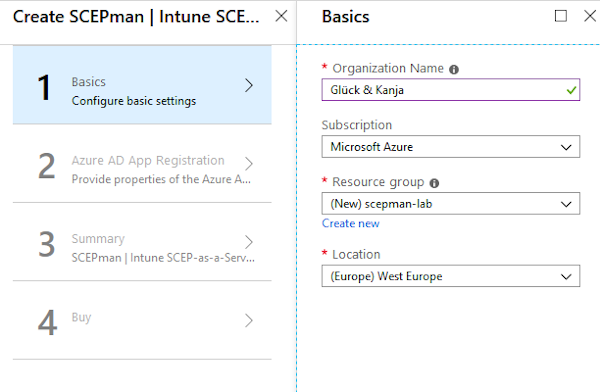
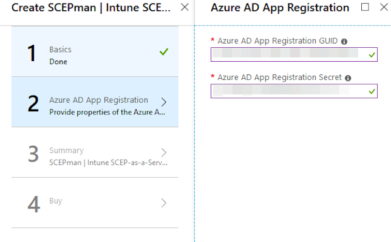
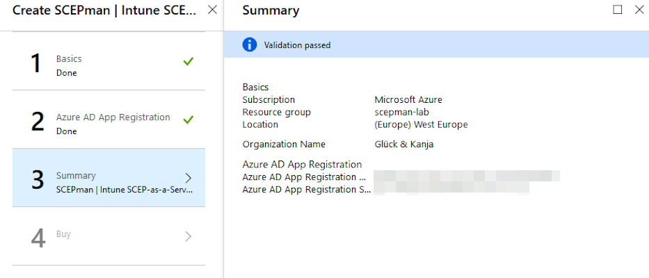
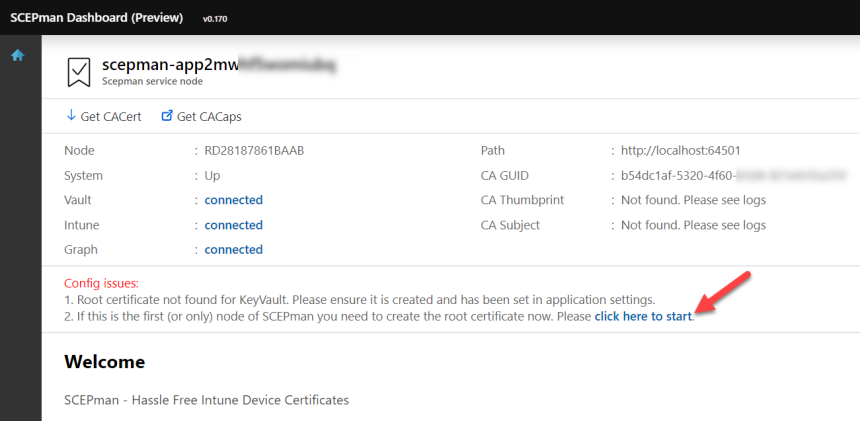

# Community deployment


You need your Client ID and your Client Secret before you can start the deployment.


When the registration of the application is done, SCEPman can be deployed to the Azure subscription.

To get SCEPman navigate to the **Azure Marketplace**. Enter SCEPman in the **Search for Marketplace** field. Find **SCEPman - Intune SCEP-as-a-Service**. Click **Create** to start with SCEPman.

Follow these steps to create a SCEPman Intune SCEP-as-a-Service instance:


If you have a license key, you can paste it in the field **License Key**. Leave it empty to use the free community edition of SCEPman.


For **Azure AD App Registration** enter the **Application \(client\) ID** and the value from **Certificates & secrets**:

When everything is right, you will see **Validation passed** in the **Summary** section. Click **OK** to go to section **Buy**.

In the **Buy** section click **Create** to start the deployment process.

To check if SCEPman is running, navigate to **App Services**. Choose the SCEPman application and click on **Browse** to see the SCEPman website. When everything works as intended **Vault**, **Intune** and **Graph** are set as **connected**.

The option **click here to start** creates the Azure Key Vault RootCA certificate. The initial root certificate should be created only once in a farm. If valid, select **I have read the documentation** and click **Create First Node**.

