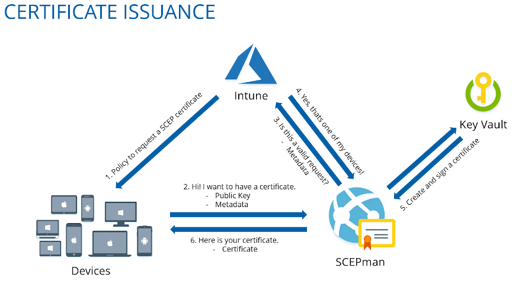
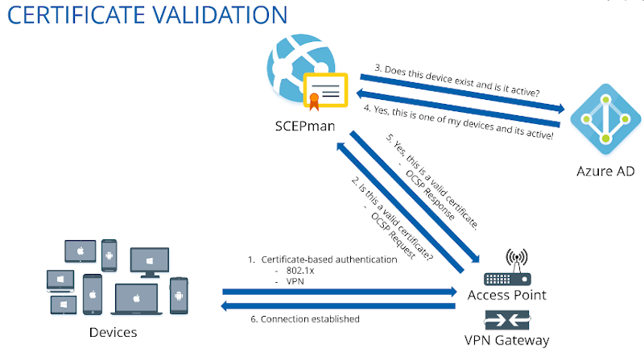

# Introduction

The following documentation will show you an easy way to deploy certificates to modern cloud managed clients. Without any on-premises PKI your users and devices will be able to get certificates.

## What is SCEP

Usually when it is necessary to deploy certificates to \(mobile\) devices [Simple Certificate Enrollment Protocol](https://tools.ietf.org/id/draft-gutmann-scep-09.html) \(SCEP\) is the first choice. But what is SCEP? SCEP is an [Internet draft](https://en.wikipedia.org/wiki/Internet_Draft) standard protocol. An Internet draft contains technical specifications and technical information. Internet drafts are often published as a [Request for Comments](https://en.wikipedia.org/wiki/Request_for_Comments).

SCEP is originally developed by Cisco. The core mission of SCEP is the deployment of certificates to network devices without any user interactions. With the help of SCEP, network devices are able to request for certificates on their own.

## What is SCEPman

If you use SCEP in a 'traditional way' you need an amount of on-premises components. Microsoft Intune [allows third-party certificate authorities \(CA\)](https://docs.microsoft.com/en-us/intune/certificate-authority-add-scep-overview) to issue and validate certificates using SCEP. SCEPman is a slim and resource-friendly solution. **It is an Azure Web App providing the SCEP protocol and works directly with the Intune API.** SCEPman uses an Azure Key Vault based Root CA and certificate creation. No other component is involved, neither a database nor any other stateful storage except the Azure Key Vault itself. That said, SCEPman **will not need any backup procedures** or other operation level tasks. Only an Azure subscription is necessary to deploy it.


**Warning**

SCEPman is intended to use for authentication and transport encryption certificates. That said, you can deploy user and device certificates used for network authentication, WiFi, VPN, RADIUS and similar services.

Do not use SCEPman for email-encryption or digital signatures \(without a separate technology for key management\). The nature of the SCEP protocol does not include a mechanism to backup or archive private key material. If you would use SCEP for email-encryption or digital signatures you may lose the keys to decrypt or verify at a later time.


For more details about the technical certificate workflow and the third-party certification authority SCEP integration, click [here](https://docs.microsoft.com/en-us/intune/certificate-authority-add-scep-overview#overview).

### SCEPman Workflow

Here's an overview about the SCEPman workflow. The first figure shows the certificate issuance and the second figure shows the certificate validation.

Process of certificate issuance:

Process of certificate validation during certificate based authentication:

### SCEPman Features

SCEPman is an Azure Web App with the following features:

* A SCEP interface that is compatible with the Intune [SCEP API](https://docs.microsoft.com/en-us/intune/certificate-authority-add-scep-overview) in particular.
* SCEPman provides certificates signed by a CA root key stored in **Azure Key Vault**.
* SCEPman contains an **OCSP responder** \(see below\) to provide certificate validity in real-time. A certificate is valid if its corresponding **Azure Active Directory \(Azure AD\)** device or user exists and is enabled.
* A full replacement of Legacy PKI.

SCEPman creates the CA root certificate during the initial installation. However, if for whatever reason an alternative CA key material shall be used it is possible to replace this CA key and certificate with your own in Azure Key Vault. For example, if you want to use a Sub CA certificate signed by an existing internal Root CA.

SCEPman issues device and user certificates that are compatible with Intune's internally used authentication certificates. They contain Intune's extensions determining the tenant and the machine. Additionally, when using device certificates the tenant ID and machine ID is stored in the certificate subject alternative names to allow a RADIUS server, like [RADIUS-as-a-Service](https://azuremarketplace.microsoft.com/en-us/marketplace/apps/gluckkanja.radius-aas?tab=Overview), to use these certificates for authentication.

### SCEPman OCSP \(Online Certificate Status Protocol\)

An [Online Certificate Status Protocol](https://community.digicert.com/en/blogs.entry.html/2015/02/26/what-is-ocsp.html) \(OCSP\) is an Internet protocol which is in use to determine the state of a certificate.

Usually, an OCSP client sends a status request to an OCSP responder. An OCSP responder verifies the validity of a certificate based on revocation state or other mechanisms. In comparison to a certificate revocation list \(CRL\), an OCSP is always up-to-date and the response is available within seconds. A CRL has the disadvantage that it is based on a database that has to refresh manually and may weight a lot of data.

## SCEPman Editions

Glück & Kanja offers two different SCEPman editions:

### SCEPman Enterprise Edition \(SCEPman EE\)

SCEPman EE offers all services and all features. If you need enterprise-class features, scalability, and performance, or if you plan to use the software in a production environment that requires support from our highly specialized support and operations team, you should consider the SCEPman Enterprise Edition.

### SCEPman Community Edition \(SCEPman CE\)

If you are a tech enthusiast with the ability to self-support, our Community Edition products are freely available and offer powerful capabilities for a non-critical business process or content needs. The only technical difference between SCEPman CE and SCEPman EE is that SCEPman CE **does not support redundancy through Azure Traffic Manager** \(no support for Azure WebApp custom domains\).

If you want to test SCEPman CE in your own environment you can use the [Azure Marketplace](https://azuremarketplace.microsoft.com/en-us/marketplace/apps/gluckkanja.scepman) and install SCEPman CE directly into your lab or production subscription. When you later decide to buy SCEPman EE you will receive a license key that [you can add to your already installed instance](documentation/setup/optional/add-a-license-key.md).


SCEPman CE is not backed by our support services.


