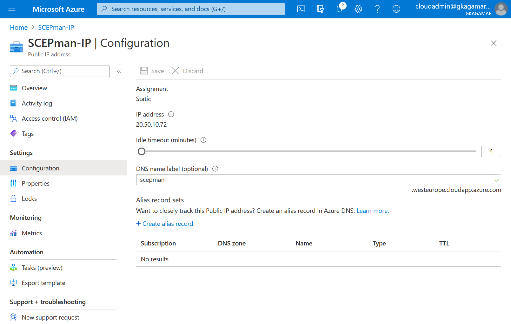
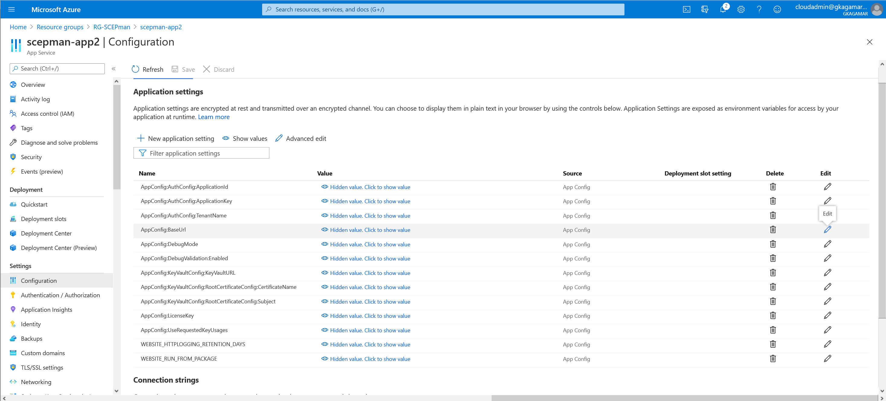
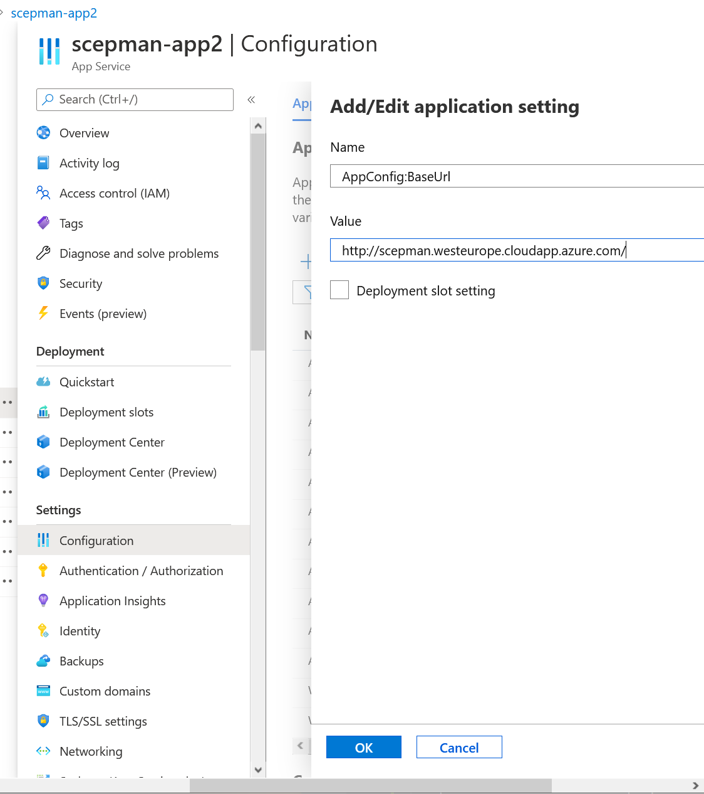

# Cisco ISE Host Header Limitation

Both Cisco ISE as well as Aruba ClearPass do not support HTTP 1.1 when looking up OCSP and do not send a host header in their OCSP request. Therefore, they cannot connect to a general SCEPman instance running on Azure App Services. The error message may look like this:

Cisco is currently investigating future enhancements but for the time being you can use an [Azure Application Gateway](https://azure.microsoft.com/en-us/services/application-gateway/) to provide an instance of SCEPman not requiring a Host Header.

The following instructions outline the steps required to create an Azure Application Gateway for SCEPman:

1\) Create a new Application Gateway

2\) Provide the necessary basic information

3\) Create a new static public IP address

4\) Create a new Backend Pool

5\) Add a routing rule for HTTP

5b\) Add a new HTTP Setting with Host Header \(your SCEPman public FQDN\)

6\) Add a routing rule for HTTPS


Important: This step requires an HTTPS web server certificate.


6b\) Add a new HTTPS Setting with Host Header \(your SCEPman public FQDN\)

7\) Confirm Routing Rules

8\) Finalize

Then, add a DNS name for the Gateway:

1. Open the IP Address resource

2. Add a name of your choice as DNS name label

3. Optional: You can add a CNAME entry for a DNS record that you own DNS servers.

Eventually, configure the new name in the SCEPman settings:

1. Go the App Service for SCEPman and open the Configuration page in the Settings section.

2. Edit the value AppConfig:BaseURL.

3. Enter the DNS name for the IP address prefixed with "http://". If you have configured a TLS certificate in the Azure Application Gateway, you may also use HTTPS.


The use of HTTP without TLS is not a security vulnerability; PKI-based resources are commonly published via HTTP without TLS, as the TLS handshake may require access to these resources. Using TLS would create a chicken-and-egg problem where the TLS handshake requires access to the PKI resources and access to the PKI resources requires a TLS handshake. Therefore, these PKI resources including the protocols SCEP and OCSP employ their own encryption and/or signatures where it is required.

