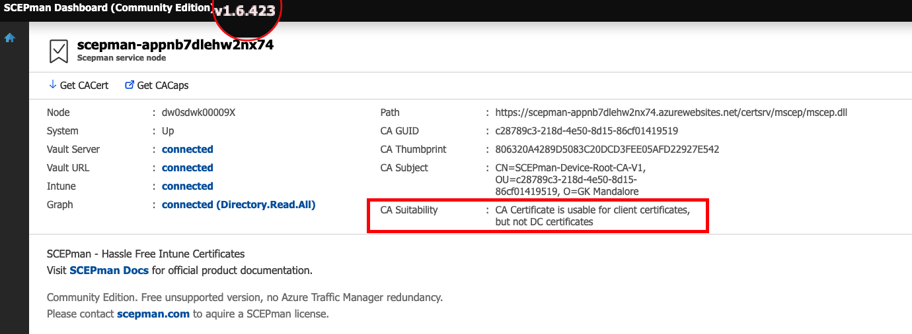
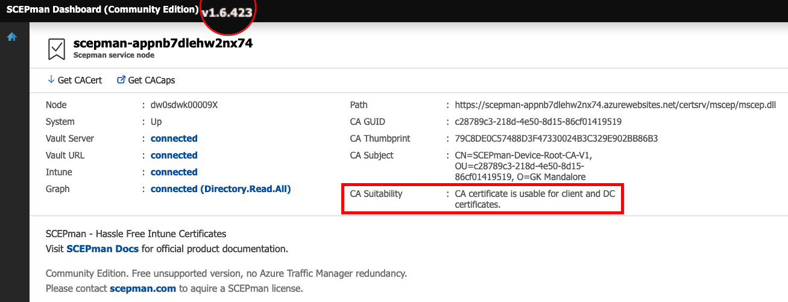

# Domain Controller Certificates


SCEPman Enterprise Edition only



This feature requires version **1.6** or above.


You can use SCEPman to issue Kerberos authentication certificates to your domain controllers. This allows your AAD or hybrid-joined devices to authenticate seamlessly when accessing on-premises resources. This can be used to implement the **Hybrid Key trust for Windows Hello for Business**. The SCEPman will replace the requirement of a **Public key infrastructure**. Details can be found [here](https://docs.microsoft.com/en-us/windows/security/identity-protection/hello-for-business/hello-hybrid-key-trust-prereqs)

## Root CA without Enhanced Key Usage \(EKU\) Extension

**This feature has new requirements to the Root CA.**   
If you are updating from an earlier version as **1.6** you must generate a **new** Root CA.   
To support Kerberos authentication certificates the CA certificate must contain either no Enchanced Key Usage \(EKU\) extension or it must include Kerberos Authentication and Smart Card Logon.   
  
If you are starting with SCEPman **1.6** and generate the Root CA with our SCEPman, you can skip the following steps.  
Otherwise please follow this guide to generate a new Root CA.

CA Suitability on SCEPman Dashboard:




If you generate a new CA certificate you must update your Intune policies and deploy the new Root CA and new User and Device certificates!


1. Navigate to your **Key Vault**
2. Check if your User Account is added to the **Access policies** with all certificate permissions
3. Go to **Certificates**, select your CA certificate and click on **Delete**
4. After you have successful deleted the CA certificate you must click on **Manage deleted certificates**
5. Select your CA certificate, that you have deleted in Step 3 and click on **Purge** \(Keep in mind that after you have purged the certificate you cannot restore it!\)
6. Now restart your SCEPman App Services
7. Once your App Services are restarted open the SCEPman Dashboard by navigating to your SCEPman URL
8. You can see the section **Config issues**, please follow the steps in this section.
9. After you have generated the new CA certificate you can check the CA suitability in the SCEPman Dashboard.

CA Suitability on SCEPman Dashboard:



## Configuration Changes to the SCEPman Service

To enable the feature, you must add two application settings in your SCEPman service. In the current implementation we use a pre-shared key \(password\) for DC requests.   
**Please generate a new key/password and store it somewhere safe.** \(you will need it in the following steps and later, on the domain Controllers\)

1. Navigate to **App Services**
2. Then choose your SCEPman app
3. Next under **Settings** click **Configuration**
4. Select **New application setting**
5. Type **AppConfig:DCValidation:Enabled** as Name
6. Type **true** as Value
7. Confirm with **OK**
8. Select **New application setting** again
9. Type **AppConfig:DCValidation:RequestPassword** as Name
10. Type your **key/password**, that you have generated earlier, as Value
11. Confirm with **OK**
12. Save the application settings

## Trust the CA certificate in the Domain for Kerberos Authentication

Certificates used for Kerberos authentication need to be trusted within the AD domain as authentication CA certificates. Please download the CA certificate from the SCEPman Dashboard. If you stored the file as `scepman-root.cer`, you can publish the root CA certificate with the following command with an account that has Enterprise Administrator rights:

```text
certutil -f -dsPublish scepman-root.cer NTAuthCA
```

Analogously, execute the following command to push the SCEPman CA certificate to the Trusted Root certificate store for all machines in the AD Forest:

```text
certutil -f -dsPublish scepman-root.cer RootCA
```

Afterwards, the CA certificate is generally trusted in AD and especially trusted for Kerberos Authentication.

## Installation on the Client

Then you must download our Open Source SCEP client software [SCEPClient](https://github.com/scepman/scepclient/releases/latest). **It requires the [.NET Core 3.1 Runtime](https://download.visualstudio.microsoft.com/download/pr/9845b4b0-fb52-48b6-83cf-4c431558c29b/41025de7a76639eeff102410e7015214/dotnet-runtime-3.1.10-win-x64.exe) to be installed on the target systems.**

Execute the following command in an elevated command prompt on a domain controller to receive a Domain Controller certificate from SCEPman:

```text
ScepClient.exe newdccert https://your-scepman-domain/dc RequestPassword
```

You must add the SCEPman URL in the previous command, but keep the path `/dc`. Replace `RequestPassword` with the secure key/password you generated earlier.

The request password is encrypted with SCEPman's CA certificate, so only SCEPman can read it. Domain Controller certificates are only issued with the correct request password.


The above command requests a new DC certificate whether or not there already is a valid certificate. See the following Section to learn how to renew certificates only if the existing certificate is about to expire.


### CA certificate Renewal

For a fully automated renewal of certificates, you should distribute ScepClient to **all** your domain controllers, together with the PowerShell script [enroll-dc-certificate.ps1](https://github.com/scepman/scepclient/blob/master/enroll-dc-certificate.ps1). Add a Scheduled task that executes the following command in a SYSTEM context:

```text
powershell -ExecutionPolicy RemoteSigned c:\scepman\enroll-dc-certificate.ps1 -SCEPURL https://your-scepman-domain/dc -SCEPChallenge RequestPassword -ValidityThreshold (New-TimeSpan -Days 30)
```

This checks for existing DC certificates in the machine store. Only if there are no suitable certificates with at least 30 days validity, it uses ScepClient.exe to request a new DC certificate from SCEPman.

For WHfB, all DCs running version 2016 or newer need a Kerberos Authentication certificate. Older DCs forward authentication requests to newer DCs, thus they do not necessarily require a Kerberos Authentication certificate. It is a best practice, though, to supply them with certificates, too.