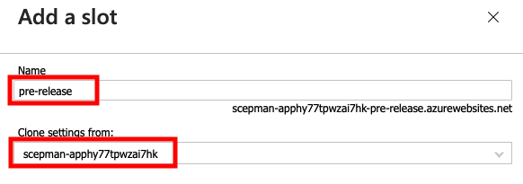

# Update Strategy

In this article we want to focus on the part of "How to Update my SCEPman installation?".

## Evergreen approach

We recommend an Evergreen approach for our SCEPman solution. That means that you should use the latest version from our production channel. Through the possibilities of the ZIP-Deployment you can point directly to our GitHub and load the latest version that is released by our development team.

How to do that is mention under this article: 



With this approach you always get the newest features and security updates. Keep in mind that an actual update occurs when the App Service is stopped and started again. This is the event when the ZIP-Deployment is triggered. By default there is no start and stop automatically.  
In a production enterprise environment, you want to have more control about the update process and for this we can use the Microsoft feature **Deployment slots**.

## Deployment slot configuration

In case that you want to have full control about the update process of SCEPman you can use the **Deployment slots** within the Azure App Service.


To get more details about the **Deplyoment slots** you can visit the Microsoft docs:   
[https://docs.microsoft.com/en-us/azure/app-service/deploy-staging-slots](https://docs.microsoft.com/en-us/azure/app-service/deploy-staging-slots)


The following steps gives you our recommended setup for a pre-release management


Please keep in mind that each deployment slot running on the same App Service Plan of your production App and use the same resources.


### pre-release slot

The idea behind the pre-release slot is to have your production App Service running with artifacts stored on your own Storage account and creating a new Deployment Slot pointing to our GitHub artifacts. You can find the steps for setting up your custom artifact's location in the following article: 



Now your production App Service is running with a custom artifacts location and we proceed with the configuration of the new Deployment Slot.

1. In your **App Service** navigate to **Deployment slots**
2. You can see your current slot marked as **PRODUCTION** with the status **Running**, this is your primary App slot

3. With the button **Add Slot** you get a new wizard to enter a **Name** and choose which existing slot you want to **clone settings from**

4. Then click on **Add** and wait until you geht the message that the slot is created successfully and **Close** the wizard  
5. Now you can see the new **Deployment slot** that is in status **Running** but have a **Traffic %** of zero  
6. You can now click on the **NAME** of your new deployment slot \(Hyperlink\) to jump directly to the App Service settings of this slot

7. Ensure that you are on your new deployment slot and following the steps described in **Application Artifacts** under **Change Artifacts** to point the **WEBSITE\_RUN\_FROM\_PACKAGE** to the GitHub of SCEPman



8. If you now go back to your primary **App Service** and navigate to **Deployment slots**  
9. You can see your two slots and can manage the **Traffic %** to root the defined among of request to the new **pre-release** slot.  
Important that this traffic rooting is completely transparent for the application and handled by the App Service. We recommend setting the **Traffic %** to **20**. After that, you can compare the two slots in **Application Insights**. In case that we are releasing an updated version to our GitHub, you only must restart the **pre-release** slot and after that you can compare the two different versions in **Application Insights**. After one week or your choice of time, you can upload the new GitHub artifacts to your custom artifacts location and have updated the SCEPman solution.

| Back to Trial Guide | Back to Community Guide | ​Back to Enterprise Guide​ |
| :--- | :--- | :--- |

